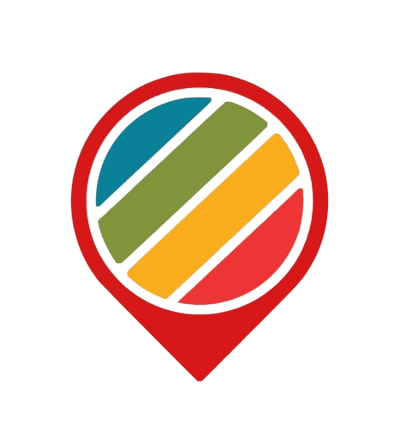

<a name="readme-top"></a>

<!-- PROJECT LOGO -->
<br />
<div align="center">
    
  <h3 align="center">BigRedDot</h3>
</div>

<!-- ABOUT THE PROJECT -->

## About The Project

BigRedDot serves as an one-stop platform for users to explore the myriad of products and services Singapore's small businesses have to offer.

### Objectives

-   Showcase local talents - By promoting local businesses, this highlights Singapore fair share of creative and talented individuals with unique products to offer.

-   Sustainability - Shopping locally reduces the reliance on the global supply chain, reducing carbon emissions

### Built With

-   Vue.js + Vite
-   Tailwind CSS
-   Swiperjs
-   GSAP
-   Vuex
-   Vue-Toastification
-   Firebase

<!-- GETTING STARTED -->

## Getting Started

Run the following command to setup and run a local copy of the project.

### Recommended IDE Setup

-   VSCode + Volar

### Installation

```bash
# clone the project
git clone https://github.com/IS216-WAD-G6-G8/BigRedDot.git
```

```bash
# install dependencies
npm install
```

### Run application locally

```bash
# launch development environment (authentication features may not be available)
npm run dev
```

### Deployment

This project is deployed automatically via [Firebase](https://firebase.google.com/) on push to the `main` branch.

Access the deployed website through https://is216-bigreddot.web.app/

<p align="right">(<a href="#readme-top">back to top</a>)</p>
